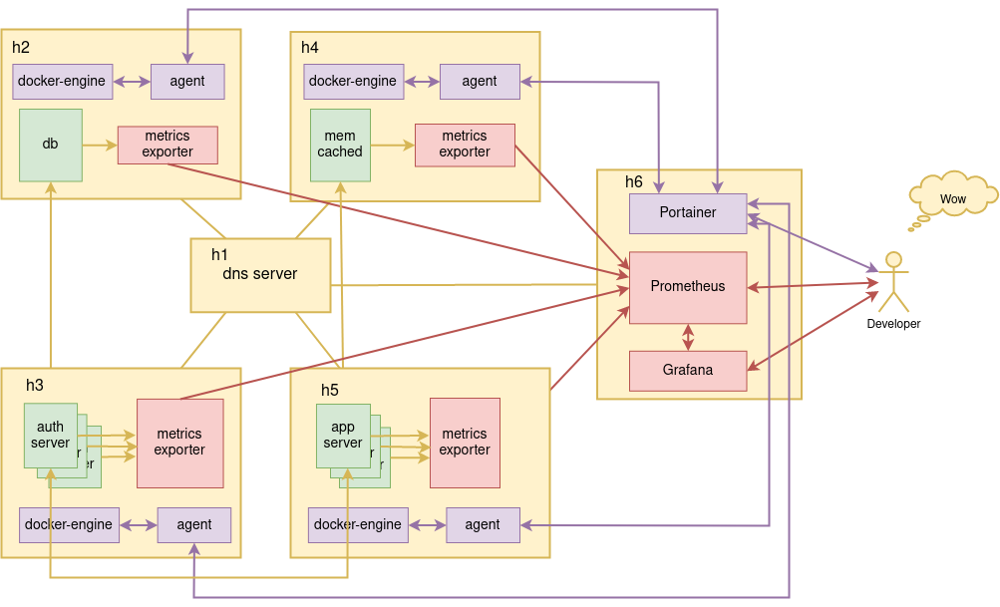

# devops
devops - cool repo for building production like setups consisting of many hosts, database, servers, etc.

---

# Use-cases
Sooner or later some developers working on a complex application setup will want to have a look how his solution works in production-like envoronment.\
A complex app setup might consist of many hosts - some running appications, some running databases and in memory key-value storages, web servers any many others.\
In this case developer will find that there is a bunch of tools like Vagrant, Ansible and many others for producing this kind of environments.\
This repository is meant to create this kind of environments, to learn all of these tools and have a look how it will work.

<p align="center">
    
</p>
<br>

---

# Simple environment example
Simple environment example below consists of 3 VMs:
* h1
    * dns server
* h2
    * database
* h3
    * server
<p align="center">
    
</p>

---

# Tough environment example
Tough environment example below is much closer to real case:
* h1
    * dns server
* h2
    * database
    * metrics exporter
    * agent (docker proxy for Portainer)
* h3
    * auth server
    * metrics exporter
    * agent (docker proxy for Portainer)
* h4
    * memcached for storing sessions
    * metrics exporter
    * agent (docker proxy for Portainer)
* h5
    * app server
    * metrics exporter
    * agent (docker proxy for Portainer)
* h6
    * Portainer - docker managment tool (web server)
    * Prometheus - metrics database (web server)
    * Grafana - metrics visualization tool (web server)
<p align="center">
    
</p>


**_metrics exporter_** in this case is a simple http server which reports correspondng metrics to **_Prometheus_**\
**_agent_** in this case is a docker engine proxy ustilized by  **_Portainer_**

---

# Tools

<p align="center">
    
</p>
<br>

---
### [Vagrant](https://en.wikipedia.org/wiki/Vagrant_(software))

Vagrant is a tool for building and maintaining virtual machines using many providers like VirtualBox, KVM, VMware, and others.\
Vagrant can be considered as a wrapper for VirtualBox or any other provider.\
Virtual machines are desribed by a **_Vagrantfile_** which is actually Ruby file.
```
$cat Vagrantfile
# -*- mode: ruby -*-
# vi: set ft=ruby :

servers=[
    {
        :hostname => "h1",
        :ip => "192.168.200.100",
        :box => "generic/ubuntu2004",
        :ram => 2048,
        :cpu => 1,
        :ports => [
            {
                :host => 3000,
                :guest => 3000,
            },
        ]
    },
    {
        :hostname => "h2",
        :ip => "192.168.200.101",
        :box => "generic/ubuntu2004",
        :ram => 1024,
        :cpu => 1,
        :ports => [
            {
                :host => 4000,
                :guest => 3000,
            },
        ]
    }
]

Vagrant.configure("2") do |config|
    servers.each do |machine|
        config.vm.define machine[:hostname] do |node|
            node.vm.box = machine[:box]
            node.vm.hostname = machine[:hostname]
            node.vm.network "private_network", ip: machine[:ip]
            node.vm.provider "virtualbox" do |vb|
                vb.customize ["modifyvm", :id, "--memory", machine[:ram]]
            end
            # forward ports
            machine[:ports].each do |ports|
                node.vm.network "forwarded_port", guest:ports[:guest], host:ports[:host]
            end
        end
    end
end
```

Once **_Vagrantfile_** is defined, you can
#### Check virtual machines status
```
$ vagrant status
Current machine states:

h1                        poweroff (virtualbox)
h2                        poweroff (virtualbox)

This environment represents multiple VMs. The VMs are all listed
above with their current state. For more information about a specific
VM, run `vagrant status NAME`.
```

#### Launch virtual machines
```
$ vagrant up
```

#### Shutdown virtual machines
```
$ vagrant halt
```

#### Create and restore snapshots
Once of the baset Vagrant features is ability to make/restore VMs snapshots.\
\
\
To make snapshots:
```
$ vagrant snapshot save v0
```
\
\
To restore snapshots:
```
$ vagrant snapshot restore v0
```

#### Vagrant installation
Installing Vagrant is a piece of cake, here is shell script which will do this for you.
```
$ cd env
$ sudo vagrant.install.sh
```

---

### [VirtualBox](https://www.virtualbox.org/)
VirtualBox - a virtualizer for x86-x64 machines, i.e. for virtual machines.\
We planning using Vagrant for VMs managemtnt - so VirtualBox is not meant to be used directly.\
Still, VirtualBox must be installed.
Once VirtualBox is installed you can create/delete/view virtual machines using VirtualBox UI tool.

<p align="center">
    
</p>

#### VirtualBox installation
VirtualBox can be installed right from official Ubuntu repositories.
```
$ sudo apt update
$ sudo apt install virtualbox
```

---

### [Ansible](https://docs.ansible.com/ansible/latest/index.html)
Ansible - a devops automation tool.\
If briefly - Ansible helps to run playbooks(recipes) on remote hosts tolet say install a package, create a file, etc.

Once playbook is run Ansible:
* Reads yaml playbooks and executes ones to every listed host(VM).
* Uses ssh to connect to the hosts.
  It means ssh public key shall be delivered to every VM.
```
$ ssh-copy-id -i ~/.ssh/id_rsa.pub vagrant@h1
```
* Has a lot of modules which can be run on a remote host and perform things like install packages, launch shell commands and many others:
    * [shell](https://docs.ansible.com/ansible/latest/collections/ansible/builtin/shell_module.html)
    * [command](https://docs.ansible.com/ansible/latest/collections/ansible/builtin/command_module.html)
    * [apt](https://docs.ansible.com/ansible/latest/collections/ansible/builtin/apt_module.html)
    * [file](https://docs.ansible.com/ansible/latest/collections/ansible/builtin/file_module.html)
    * [template](https://docs.ansible.com/ansible/latest/collections/ansible/builtin/template_module.html)
    * [docker_swarm_info](https://docs.ansible.com/ansible/latest/collections/community/docker/docker_swarm_info_module.html)
    * [docker_swarm](https://docs.ansible.com/ansible/latest/collections/community/docker/docker_swarm_module.html)
    * [docker_swarm_service](https://docs.ansible.com/ansible/latest/collections/community/docker/docker_swarm_service_module.html)

#### Ro run a playbook
```
$ ansible-playbook -i hosts -K main.yml
```

#### Ansible installation
Installing Ansible is another piece of cake, here is shell script which will do this for you.
```
$ cd env
$ sudo ansible.install.sh
```

---

### [Portainer](https://documentation.portainer.io/)
Portainer is powerful tool for managing docker engine, i.e. containers, images, networks, stacks, etc..\
Consists of 2 parts:
* Portainer itself, web server providing UI for managing docker engine - launching containers, and everything what docker can do
* Portainer agent - a proxy for ruling docker-engines located at another hosts

#### Portainer installation
Portainer is not meant for installation on main(working) host directly.\
Portainer is meant to be installed on a single host conforming the environment.\
Portainer agent is meant to be installed on every host(excluding host with Portainer) conforming the environment.\

Down here are some exampleis what Portainer looks like.

<p align="center">
    
</p>

---

<p align="center">
    
</p>

---

<p align="center">
    
</p>


---

### [Prometheus](https://en.wikipedia.org/wiki/Prometheus_(software))
Prometheus is monitoring system & time series database.\
Collects(polls) metrics from remote hosts over http.\
Most tools like postgress, docker and others have exporters for Prometheus.\
Has a web server(Frontend) for presenting metrics and other stuff.

#### Prometheus installation
Prometheus is not meant for installation on main(working) host directly.\
Prometheus is meant to be installed on a single host conforming the environment.\
Using [dockprom](https://github.com/stefanprodan/dockprom) for complete Prometheus + Grafana setup.

Down here is an example what Prometheus charts look like.
<p align="center">
    
</p>

---

### [Grafana](https://en.wikipedia.org/wiki/Grafana)
Grafana is metrics visualization tool.\
Collects and visualizes metrics from Prometheus.\ 
Presenting mestrics via a set of Dashboards where each Dashboard has several charts.\
It's a web server(Frontend) presenting Prometheus data using nice charts.

#### Grafana installation
Grafana is not meant for installation on main(working) host directly.\
Grafana is meant to be installed on a single host conforming the environment.\
Using [dockprom](https://github.com/stefanprodan/dockprom) for complete Prometheus + Grafana setup.

Down here is an example what Grafana charts look like.
<p align="center">
    
</p>

---

### Docker, docker-compose, docker swarm mode, docker registry
docker and Co is well know set of tools for managing docker images, containers, running applications in swarm mode(many workers with load balancing)

