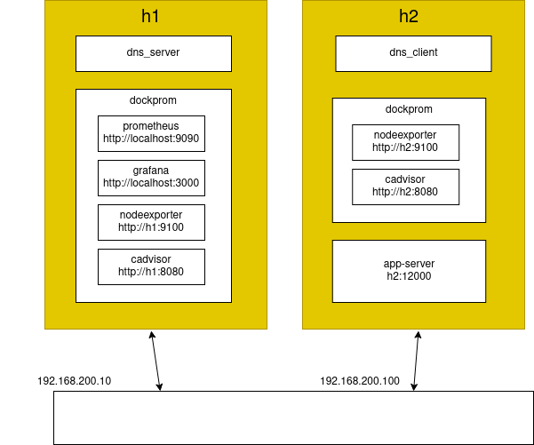

# Hosts and services setup
This test runs 2 VMs:
 - h1
     - dns server
     - dockprom
         - prometheus, port 9090
         - grafana, port 3000
         - nodeexporter, port 9100
         - cadvisor, port 8080
 - h2
     - simple server powered by node.js

The whole setup is pretty much close to real production environment.\
For VM management I use Vagrant.\
For devops management I use ansible.


***Fig1. Hosts and services setup***

<p align="center">
    
</p>
<br>


### Setup bash aliases
Append these bash aliases into your ~/.bashrc
```
alias VST='vagrant status'\
alias VUP='vagrant up'\
alias VHALT='vagrant halt'\
alias VPORTS='vagrant port'\
alias VPROVISION='vagrant provision'\
alias VRESTORE='vagrant snapshot restore v1.ssh'\
alias H1='ssh vagrant@h1'\
alias H2='ssh vagrant@h2'\
alias H3='ssh vagrant@h3'\
alias H4='ssh vagrant@h4'\
alias ARUN='ansible-playbook -i hosts -K main.yml'\
```


### Launch VMs and make a snapshot
```
$ VUP
```
Make sense to take VM snapshots like this:
```
$ VHALT
$ vagrant snapshot save v0.initial
```
Start VMs again:
```
$ VUP
```


### Setup ssh access
Ansible is in charge for devops here: to manage all the hosts, to install packages and other stuff.\
Ansible uses ssh and therefore all hosts SHALL be sshed with no password.\
Have to create and deploy ssh keys now.


###### Create and add ssh keys
```
$ ssh-keygen -t rsa -f ansible.ssh.stuff -C "someuser@somedoman.com"
$ ssh-add ./ansible.ssh.stuff
```
If password is requested - press ENTER


###### Copy ssh keys to VMs
```
$ ssh-copy-id -i ansible.ssh.stuff.pub vagrant@h1
$ ssh-copy-id -i ansible.ssh.stuff.pub vagrant@h2
```
Use "vagrant" as password


###### Check that h1 and h2 are sshed with no password
```
$ H1
$ H2
```


### Make sense to take VM snapshots like this(clean with ssh access):
```
$ VHALT
$ vagrant snapshot save v1.ssh
```
Start VMs again:
```
$ VUP
```


### Setup VMs by running ansible
```
$ cd ansible
$ ARUN
```
Ansible will ask "BECOME" password - use "vagrant"


### Check things work


### Check dockprom and exporters work
Poll all exportes like this
```
$ curl localhost:9100/metrics
$ curl localhost:9100/metrics
$ curl localhost:8080/metrics
```


Check prometheus works
* http://localhost:9090

Check grafana works
* http://localhost:3000


### Check app works
```
$ curl localhost:3100
[fb72b1c8015e@root] Hallo Node.js Server, reqs:2
$ curl localhost:3100
[1b99f6085a38@root] Hallo Node.js Server, reqs:2
$ curl localhost:3100
[fb72b1c8015e@root] Hallo Node.js Server, reqs:3
$ curl localhost:3100
[1b99f6085a38@root] Hallo Node.js Server, reqs:3
$ curl localhost:3100
[fb72b1c8015e@root] Hallo Node.js Server, reqs:4
$ curl localhost:3100
[1b99f6085a38@root] Hallo Node.js Server, reqs:4
$ curl localhost:3100
[fb72b1c8015e@root] Hallo Node.js Server, reqs:5
$ curl localhost:3100
[1b99f6085a38@root] Hallo Node.js Server, reqs:5
```


### Shutdown VMs
```
$ VHALT
```

