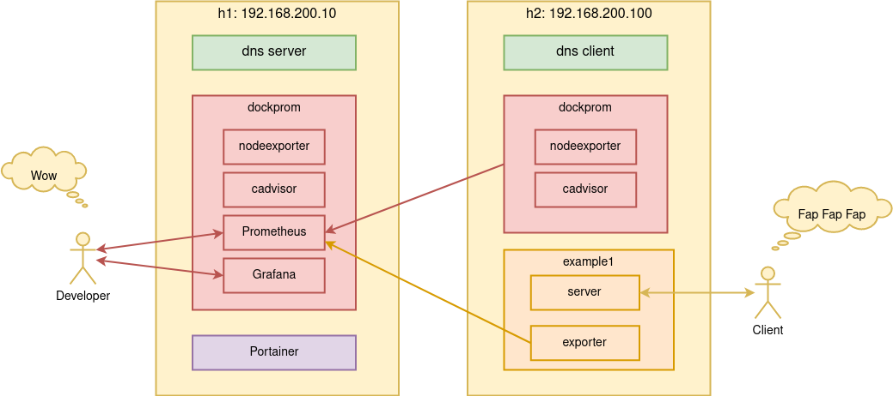
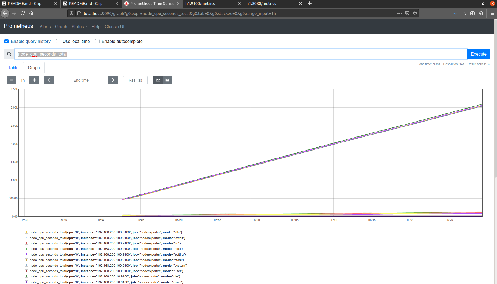
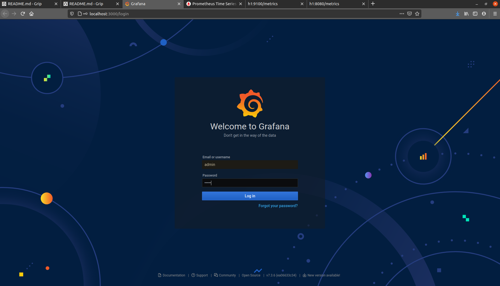
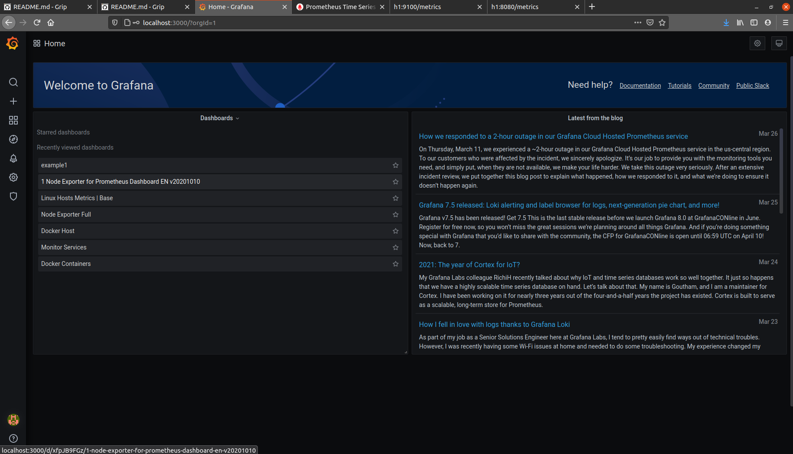
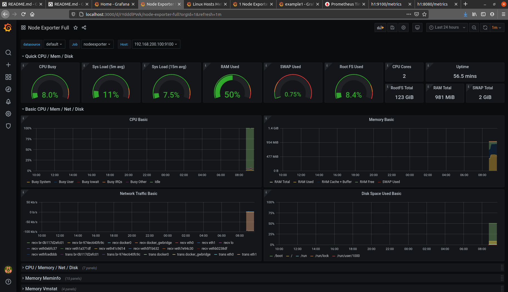
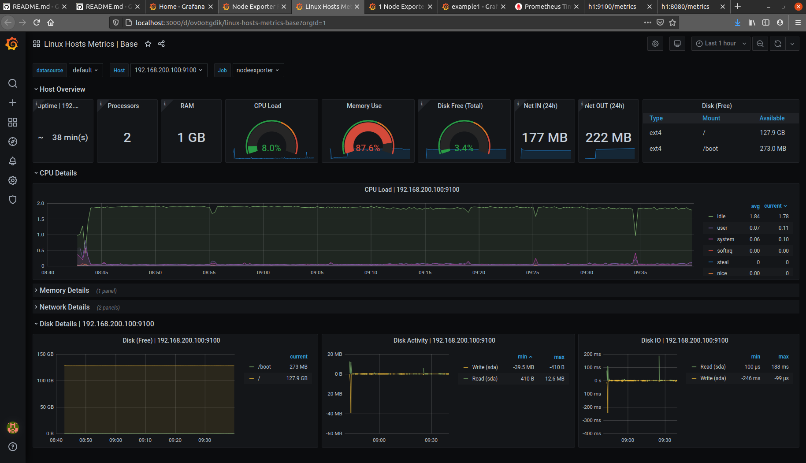
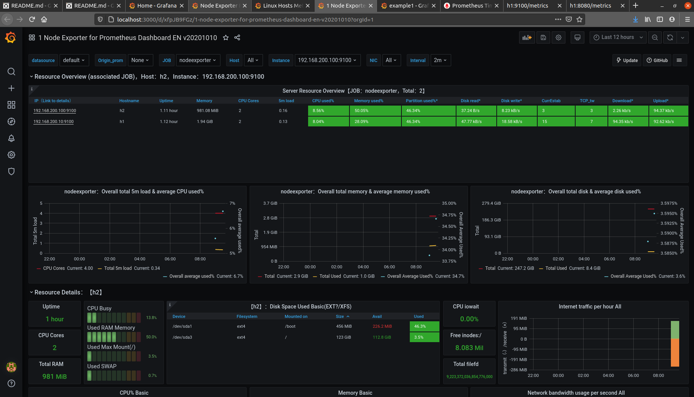
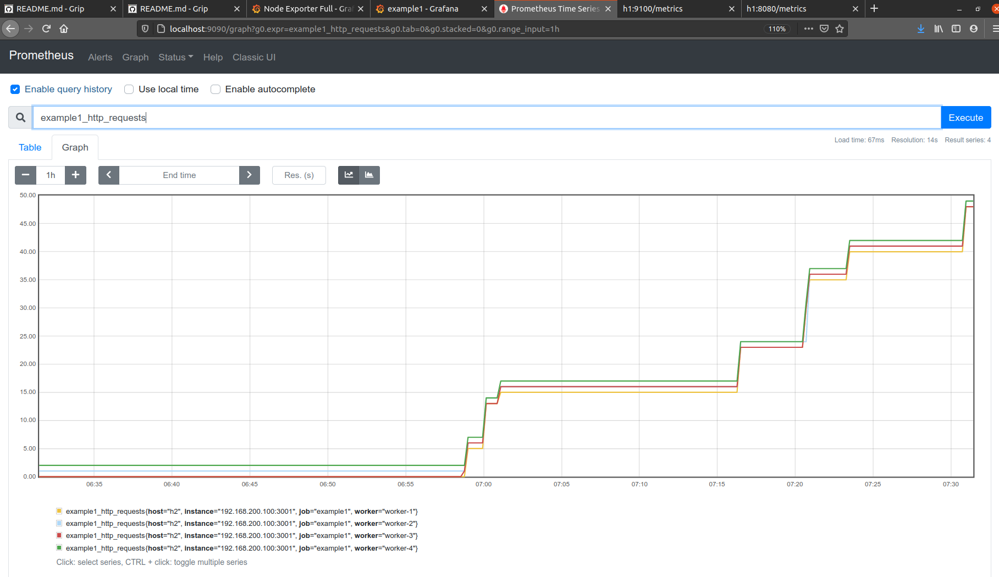
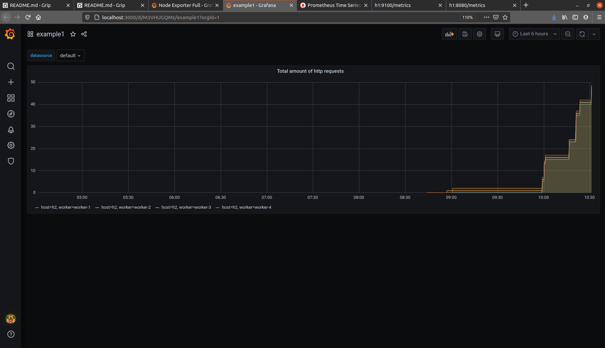

# example1 environment layout
This example runs 2 VMs:
 - h1
     - dns server
     - Portainer
     - [Portainer:9000](http://localhost:9000)
     - dockprom
         - [prometheus:9090](http://localhost:9090)
         - [grafana:3000](http://localhost:3000)
         - [nodeexporter:9100](http://h1:9100)
         - [cadvisor:8080](http://h1:8080)
 - h2
     - dockprom
         - [nodeexporter:9100](http://h2:9100)
         - [cadvisor:8080](http://h2:8080)
     - example1
         - [server:3000](http://h2:3000), simple server powered by node.js
         - [server-expoerter:3001/metrics](http://h2:3001/metrics), application metrics exporter for Prometheus and Grafana

The whole setup is pretty much close to real production environment.


<p align="center">
    <b>Environment layout</b><br>
    
</p>
<br>

---

# Example1 application

### Server
Server is very simple http server.\
It has only ***/*** route and sends back ***Hallo Node.js Server***.\
Upon request server stores amount of handled http requests into ***/var/example1/http_requests/<host>/<worker>***\
Server is built into a docker image and stored in Docker Hub: https://hub.docker.com/repository/docker/dondonald/devops-tsrc-example1-server  \
Server sources are located at ***devops/tsrc/example1/src/server***

### Metric exporter
Metrics exporter is very simple http server.\
It has only ***/metrics*** route and sends back ***example1_http_requests***.\
Upon request server iterates over ***/var/example1***, collects metrics for every host and every worker and returns these metrics to the client.\
Server is built into a docker image and stored in Docker Hub: https://hub.docker.com/repository/docker/dondonald/devops-tsrc-example1-exporter  \
Server sources are located at ***devops/tsrc/example1/src/exporter***

### Grafana ***example1*** dashboard
In order to visualize metrics in Grafana exporter defines a dashboard.\
Dashboard is located at ***devops/tsrc/example1/src/exporter/grafana.dashboard.v2.json***\
Once ansible is run it will deploy this dashboard right into Grafana.

---

# Setup

### Setup bash aliases
To simplify using console, lets create a set of bash aliaces.\
Append these bash aliases into your ~/.bashrc
```
alias VST='vagrant status'
alias VUP='vagrant up'
alias VHALT='vagrant halt'
alias VPORTS='vagrant port'
alias VPROVISION='vagrant provision'
alias VRESTORE='vagrant snapshot restore v1.ssh'
alias H1='ssh vagrant@h1'
alias H2='ssh vagrant@h2'
alias ARUN='ansible-playbook -i hosts -K main.yml'
```


### Launch VMs
```
$ VUP
```


### Setup ssh access
Ansible is in charge for devops here: to manage all the hosts, to install packages and other stuff.\
Ansible uses ssh and therefore all hosts SHALL be sshed with no password.\
Have to create and deploy ssh keys now.


#### Create and add ssh keys
```
$ ssh-keygen -t rsa -f ansible.ssh.stuff -C "someuser@somedoman.com"
$ ssh-add ./ansible.ssh.stuff
```
If password is requested - press ENTER


#### Copy ssh keys to VMs
```
$ ssh-copy-id -i ansible.ssh.stuff.pub vagrant@h1
$ ssh-copy-id -i ansible.ssh.stuff.pub vagrant@h2
```
Use "vagrant" as password


#### Check that h1 and h2 are sshed with no password
```
$ H1
$ H2
```


### Make VMs snapshots
Let's create now snapshots for clean machines with working ssh like this:
```
$ VHALT
$ vagrant snapshot save v1.ssh
```
Start VMs again:
```
$ VUP
```


#### VRESTORE alias
Here is a special VRESTORE alias for restoring VMs.\
VRESTORE restores snapshots named ***v1.ssh***\
If something goes wrong you can always do VHALT/VRESTORE/VHALT/VUP to recover to clean environment


### Deploy environment by running ansible
```
$ cd ansible
$ ARUN
```
Ansible will ask BECOME password - ***vagrant***\
Environtment setup will take some time, go and have a cup of coffe.

---

# Check example1 environment works


### Check dockprom works


#### Check exporters work

Check exportes for h1
* [nodeexporter:9100/metrics](http://h1:9100/metrics)
* [cadvisor:8080/metrics](http://h1:8080/metrics)

Check exportes for h2
* [nodeexporter:9100/metrics](http://h2:9100/metrics)
* [cadvisor:8080/metrics](http://h2:8080/metrics)


#### Check prometheus works

* http://localhost:9090

Try to query ***node_cpu_seconds_total*** for instance.\
Metrics names you can collect from from exporters.

<p align="center">
    <b>Prometheus</b><br>
    
</p>
<br>


#### Check Grafana works

* http://localhost:3000


Grafana will ask to create admin password.\
Use ***admin*** for user and pasword here or any password you want.

<p align="center">
    <b>Grafana login</b><br>
    
</p>
<br>


Right after login, you will see collection of dashboards.\
Four of these dashboards we installed by environment setup.

<p align="center">
    <b>Grafana dashboards</b><br>
    
</p>


<p align="center">
    <b>Dashboard 1860: Node Exporter Full</b><br>
    
</p>


<p align="center">
    <b>Dashboard 10180: Linux Hosts Metrics | Base</b><br>
    
</p>


<p align="center">
    <b>Dashboard 11074: Node Exporter for Prometheus Dashboard EN v20201010</b><br>
    
</p>
<br>
<br>
<br>


### Check app works
Now it's time to check that the application works and collect its' metrics.\
To do so simply time to time query app server.
```
$ curl h2:3000 && curl h2:3000 && curl h2:3000 && curl h2:3000 && curl h2:3000 && curl h2:3000 && curl h2:3000 && curl h2:3000 && curl h2:3000 && curl h2:3000
```
Than have a brake and query app server again and anoter brake.\
The purpose of that loop is to check how Grafana and Prometheus visualize application metrics.

#### Query Prometheus for ***example1_http_requests***

When quering ***example1_http_requests*** you will notice how metric gets changed in time for every worker.
<p align="center">
    <b>Prometheus: quering example1_http_requests</b><br>
    
</p>


#### Check exampe1 dashboard for Grafana

<p align="center">
    <b>Grafana: example1 dashboard</b><br>
    
</p>


### Shutdown VMs
```
$ VHALT
```

---

# Conclusions

* Example application runs in docker swarm mode, 4 workers totally
* Eaxmple application provides a metrics exporter exporting only ***example1_http_requests***
* Prometheus visualizes ***example1_http_requests*** and produces a chart
* Grafana is appended ***example*** dashboard and visualizes ***example1_http_requests*** and produces a chart
* Everything is cool

