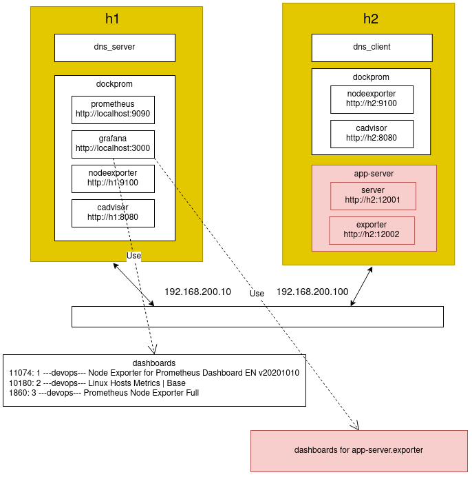
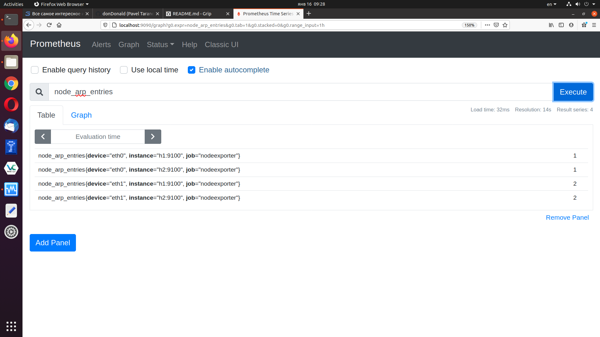
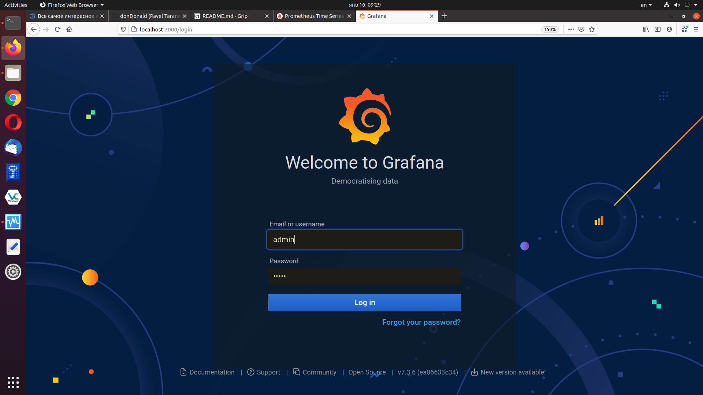
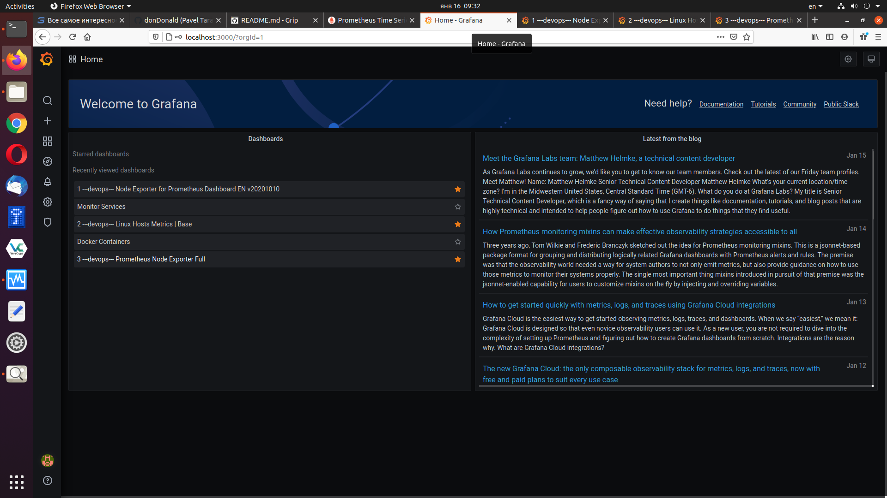
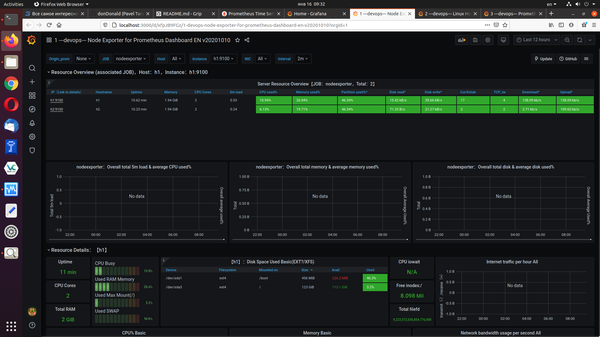
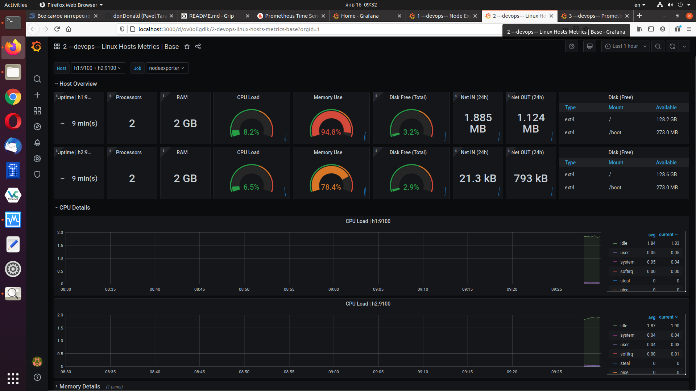
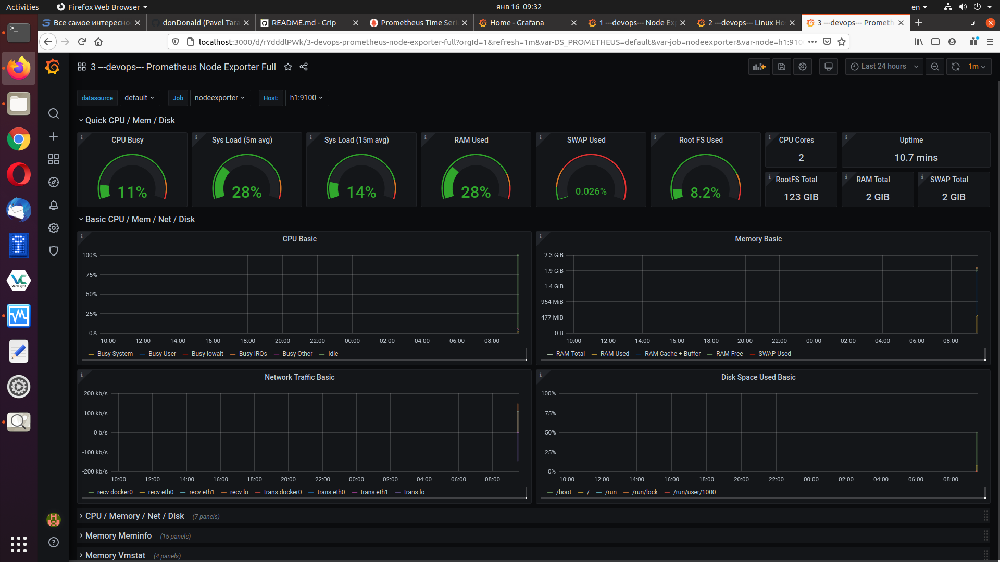

# Hosts and services setup
This example runs 3 VMs:
 - h1
     - dns server
     - dockprom
         - [prometheus](http://localhost:9090), port 9090
         - [grafana](http://localhost:3000), port 3000
         - [nodeexporter](http://h1:9100), port 9100
         - [cadvisor](http://h1:8080), port 8080
 - h2
     - dockprom
         - [nodeexporter](http://h2:9100), port 9100
         - [cadvisor](http://h2:8080), port 8080
     - example1
         - [server](http://h2:3000), simple server powered by node.js
         - [server](http://h2:3000/metrics), application metrics
 - h3
     - dockprom
         - [nodeexporter](http://h3:9100), port 9100
         - [cadvisor](http://h3:8080), port 8080
     - example1
         - [server](http://h3:3000), simple server powered by node.js
         - [server](http://h3:3000/metrics), application metrics

The whole setup is pretty much close to real production environment.\
For VM management I use Vagrant.\
For devops management I use ansible.


<p align="center">
    <b>Fig1. Hosts and services setup</b><br>
    
</p>
<br>


### Setup bash aliases
Append these bash aliases into your ~/.bashrc
```
alias VST='vagrant status'
alias VUP='vagrant up'
alias VHALT='vagrant halt'
alias VPORTS='vagrant port'
alias VPROVISION='vagrant provision'
alias VRESTORE='vagrant snapshot restore v1.ssh'
alias H1='ssh vagrant@h1'
alias H2='ssh vagrant@h2'
alias H3='ssh vagrant@h3'
alias H4='ssh vagrant@h4'
alias ARUN='ansible-playbook -i hosts -K main.yml'
```


### Launch VMs
```
$ VUP
```


### Setup ssh access
Ansible is in charge for devops here: to manage all the hosts, to install packages and other stuff.\
Ansible uses ssh and therefore all hosts SHALL be sshed with no password.\
Have to create and deploy ssh keys now.


###### Create and add ssh keys
```
$ ssh-keygen -t rsa -f ansible.ssh.stuff -C "someuser@somedoman.com"
$ ssh-add ./ansible.ssh.stuff
```
If password is requested - press ENTER


###### Copy ssh keys to VMs
```
$ ssh-copy-id -i ansible.ssh.stuff.pub vagrant@h1
$ ssh-copy-id -i ansible.ssh.stuff.pub vagrant@h2
$ ssh-copy-id -i ansible.ssh.stuff.pub vagrant@h3
```
Use "vagrant" as password


###### Check that h1 and h2 are sshed with no password
```
$ H1
$ H2
$ H3
```


### Take VM snapshots
Let's create now snapshots for clean machines with working ssh like this:
```
$ VHALT
$ vagrant snapshot save v1.ssh
```
Start VMs again:
```
$ VUP
```


###### VRESTORE alias
Here is a special VRESTORE alias for restoring VMs.\
VRESTORE restores snapshots named ***v1.ssh***\
If something goes wrong you can always do VHALT/VRESTORE/VHALT/VUP to recomer to clean 


### Setup VMs by running ansible
```
$ cd ansible
$ ARUN
```
Ansible will ask BECOME password - ***vagrant***


### Check things work


### Check dockprom and exporters work
Poll all exportes like this
```
$ curl localhost:9100/metrics
$ curl localhost:9100/metrics
$ curl localhost:8080/metrics
```


Check prometheus works
* http://localhost:9090

<p align="center">
    <b>Fig2. prometheus</b><br>
    
</p>
<br>


Check grafana works
* http://localhost:3000
Use ***admin*** for user and pasword here


<p align="center">
    <b>Fig3. grafana login</b><br>
    
</p>
<br>


<p align="center">
    <b>Fig4. grafana home</b><br>
    
</p>
<br>


<p align="center">
    <b>Fig5. Dashboard 11074: 1 ---devops--- Node Exporter for Prometheus Dashboard EN v20201010</b><br>
    
</p>
<br>


<p align="center">
    <b>Fig6. Dashboard 10180: 2 ---devops--- Linux Hosts Metrics | Base</b><br>
    
</p>
<br>


<p align="center">
    <b>Fig7. Dashboard 1860: 3 ---devops--- Prometheus Node Exporter Full</b><br>
    
</p>
<br>


### Check app works
```
$ curl localhost:12001
```


### Shutdown VMs
```
$ VHALT
```

